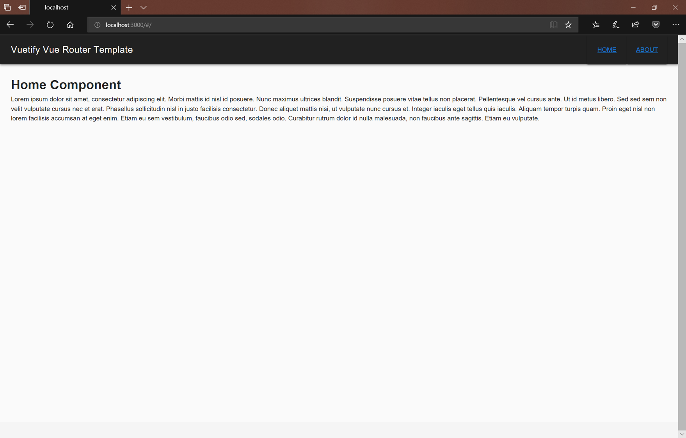

# Vuetify/Vue Router Sample Application

Demo application showcasing standalone Vuetify/Vue Router Application.



## Install (Server)
```bash
git clone https://github.com/lqdev/vuetifyrouterdemo.git
cd vuetifyrouterdemo
npm install
```

## Install (Front-End)
```bash
cd public
npm install
```

## Run Application

From the root project directory enter

```bash
npm start
```

In your web browser navigate to `http://localhost:3000/` 
